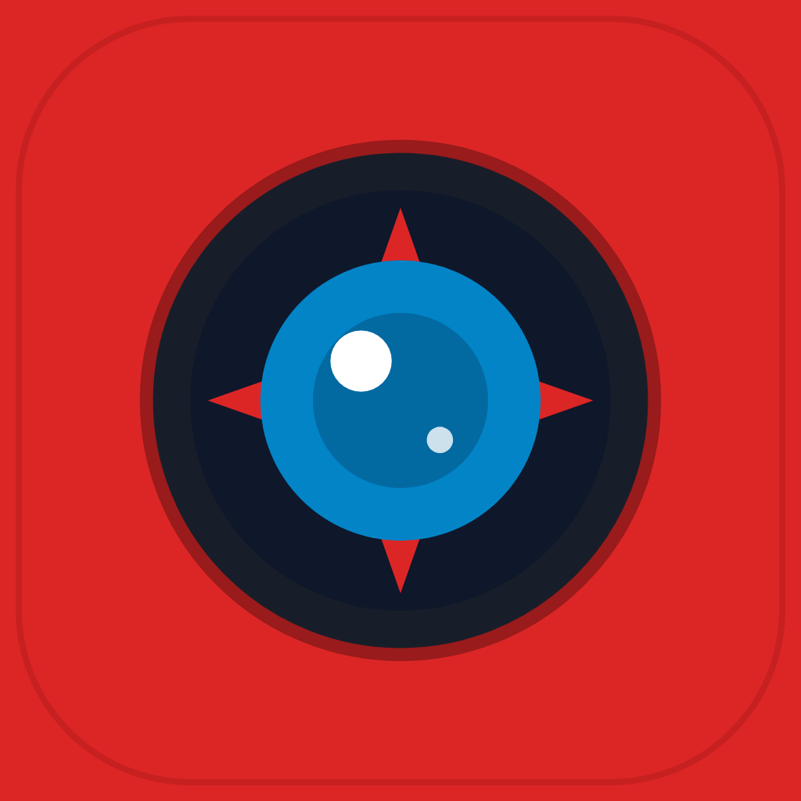
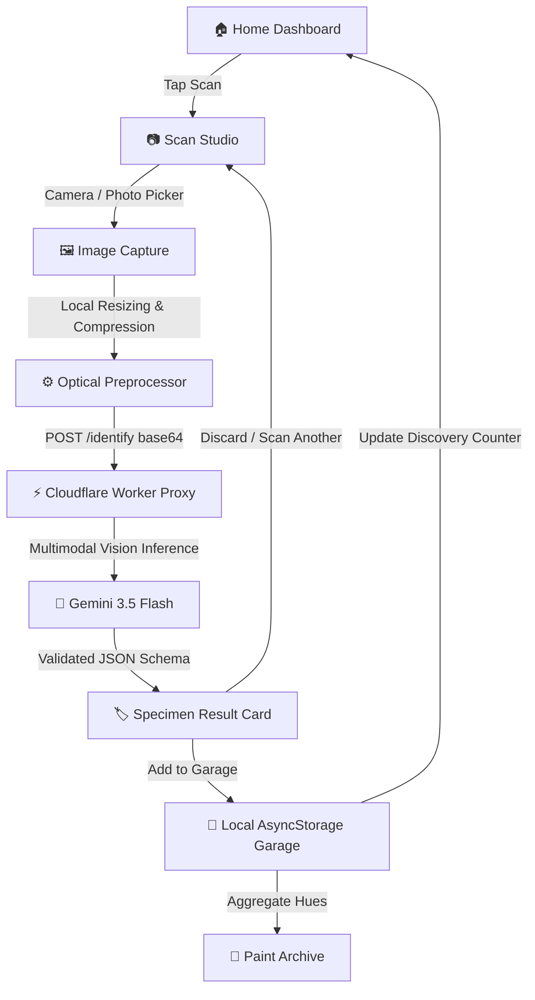
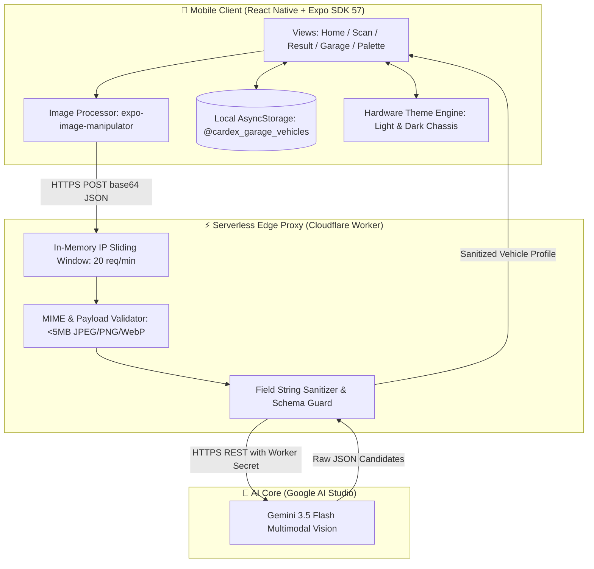
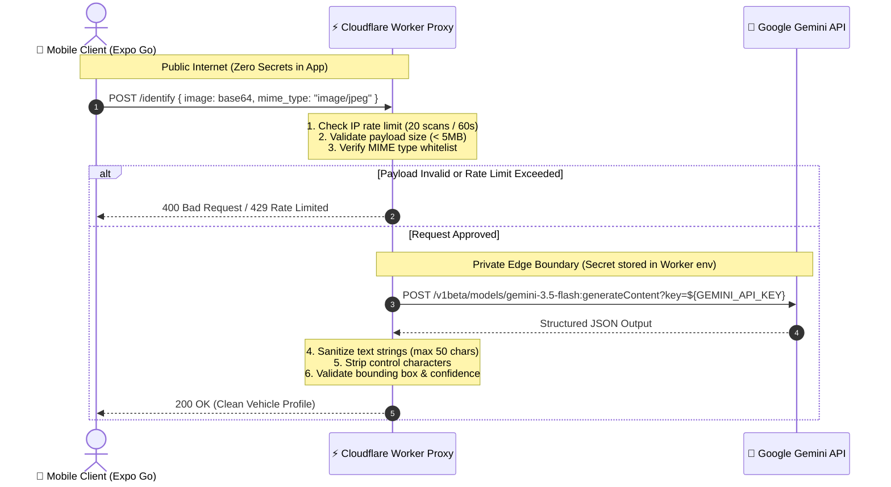

# 🏎️ CARDEX

<div align="center">



# CARDEX
### Scan. Identify. Collect.

> *Your field guide for the cars you encounter.*

**“Catch cars, not Pokémon.”**

<br/>

[](https://expo.dev)
[](https://reactnative.dev)
[](https://www.typescriptlang.org)
[](https://workers.cloudflare.com)
[](https://ai.google.dev)

</div>

---

## 📡 Wild Encounter

You're walking down the street and spot a striking sports coupe with unfamiliar badges, a vintage roadster parked curbside, or a tuned hot hatch at a traffic light. 

**CarDex** turns your phone camera into a pocket automotive field guide. Point your camera at any vehicle, snap a photo, and within seconds CarDex identifies the **Make**, **Model**, **Variant/Trim**, **Dominant Paint Finish**, and visual confidence score. Register your encounter into your personal offline **Garage**, curate your collection, and catalogue the colours you discover in the **Paint Archive**.

Built as a capstone project in **AI Tools and Techniques**, CarDex explores edge multimodal computer vision, zero-cost serverless proxy architecture, and tactile, handheld-hardware interaction design.

---

## 🧭 Why CarDex Exists

Modern AI applications frequently suffer from two anti-patterns:
1. **Insecure Clients**: Embedding sensitive API keys directly in mobile client bundles or `.env` files where anyone can extract them.
2. **Infrastructure Bloat**: Requiring heavy, paid cloud databases and complex microservices for simple personal collection apps.

CarDex is engineered as an **offline-first, zero-secrets field companion**:
* **Zero Secrets in Client**: The mobile app knows nothing about Google Gemini API keys. All inference passes through a hardened Cloudflare Worker edge proxy.
* **100% Free-Tier Architecture**: Built entirely on free, open infrastructure—Expo Go for client runtime, Cloudflare Workers free plan (100,000 req/day), Google Gemini free API quota, and local on-device `AsyncStorage`.
* **Tactile Hardware Identity**: Inspired by the physical machines of classic handheld electronic encyclopedias—bold chassis casing, dark LCD readouts, status LEDs, and responsive feedback.

---

## ⚡ Core Features

* 🔍 **Optical Vehicle Identification**: High-accuracy zero-shot identification of passenger vehicles using Google Gemini 3.5 Flash multimodal vision.
* 🏷️ **Comprehensive Specimen Data**: Detects vehicle **Make**, **Model**, verifiable **Variant/Trim**, primary **Colour Name**, and top candidate alternatives with percentage confidence scores.
* 📦 **Local Garage Collection**: Persist identified vehicles directly to your device with local photo caching and collision-resistant UUIDs via `AsyncStorage`.
* 🎨 **Automotive Paint Archive**: Automatically classifies vehicles by factory paint finish families (*Apex Red*, *Midnight Black*, *Liquid Silver*, *Sunburst Yellow*, *Deep Blue*).
* 🗑️ **Safe Vehicle Deletion**: Dedicated "Remove from Garage" flow with confirmation safeguards against accidental removal, instantly synchronizing Garage, Home, and Palette counters.
* 🌓 **Hardware-Inspired Themes**: Custom **Light** (Classic Field Chassis Red `#DC2626`) and **Dark** (Automotive Crimson `#881337`) hardware housing with dark LCD cockpit displays.
* ⚡ **Edge Preprocessing**: Normalizes and compresses photos on-device down to 1024px JPEG, slashing network payload sizes by ~85% before transmission.
* 🛡️ **Edge Abuse Protection**: Built-in sliding-window IP rate limiting (20 scans/minute) and strict payload validation at the Cloudflare edge.

---

## 📖 The Field Encounter (User Journey)

```
[HOME DASHBOARD]
       │
       ▼ (Tap "Scan a Car")
 [CAMERA / GALLERY] ──► Aim sensor reticle at vehicle & capture photo
       │
       ▼
[IMAGE PREPROCESSING] ──► Auto-orient, downscale to ≤1024px, compress to 80% JPEG
       │
       ▼
 [EDGE PROXY CHECK] ──► Verify MIME, enforce rate limit (<20 req/min), forward to AI
       │
       ▼
[SPECIMEN IDENTIFIED] ──► Render collectible card with Make, Model, Trim, Confidence & Swatch
       │
       ├─────────────────────────┐
       ▼                         ▼
[ADD TO GARAGE]           [DISCARD / RESCAN]
       │                         │
       ▼                         ▼
[PERMANENT COLLECTION]    [READY FOR NEXT CAR]
       │
       ▼
[PAINT ARCHIVE SYNC] ──► Color swatch indexed in personal spectrum
```

---

## 📊 Visual System Diagrams

### Diagram 1: User Experience Flow



---

### Diagram 2: System Architecture



---

### Diagram 3: Security Boundary & Secret Isolation



---

## ⚙️ Professor's Notes (Technical Deep Dive)

### 1. Edge Image Preprocessing
Raw smartphone camera captures often exceed **12 to 48 megapixels** (8MB–25MB uncompressed). Transmitting raw images over cellular connections causes slow inference, mobile data drain, and frequent edge timeouts.

CarDex implements a local image preprocessing stage using `expo-image-manipulator` prior to network transmission:
* **Aspect-Preserving Downscaling**: The long edge is clamped to a maximum of **1024px**.
* **JPEG Re-Encoding**: Compressed with a quality factor of `0.8` (80%).
* **Payload Reduction**: Shrinks typical camera payloads from **~15MB down to ~150KB–250KB** (over 85% compression) while preserving badging, grille geometry, and headlight shapes required for AI identification.

### 2. The Cloudflare Edge Proxy Boundary & High-Availability Cascade
The mobile client never speaks directly to AI providers. All traffic routes through a lightweight Cloudflare Worker:
* **Secret Protection**: `GEMINI_API_KEY` (and optional fallback keys) reside strictly in the serverless environment secret store. Decompiled application binaries contain zero credentials.
* **Multi-Tier Model Cascade**: To maximize uptime on Google AI Studio's free tier, the Worker automatically fails over across models:
  1. `gemini-3.5-flash-lite` (Primary: 500 Requests/Day, 15 Requests/Minute)
  2. `gemini-2.5-flash-lite` (Secondary: 20 Requests/Day, 10 Requests/Minute)
  3. `gemini-3.5-flash` (Tertiary: 20 Requests/Day, 5 Requests/Minute)
* **Optional OpenRouter Fallback**: If configured, the Worker can seamlessly fail over to free vision models on OpenRouter (`gemini-2.0-flash-lite:free`, `llama-3.2-11b-vision-instruct:free`, `qwen-2.5-vl-72b-instruct:free`).
* **Abuse & Quota Protection**: Sliding-window IP rate limiting restricts rapid client spam. On HTTP 429 quota exhaustion, the mobile client activates an automatic 10-second button cooldown timer.
* **Controlled Schema Enforcement**: Gemini is prompted with a strict JSON generation schema. If no motor vehicle is detected, the model outputs `make: "NO_CAR"`, which the Worker maps to a clean `422 Unprocessable Entity` response rather than hallucinating a vehicle.
* **Sanitized Outputs**: All text fields (`make`, `model`, `variant`, `colour_name`) are stripped of ASCII control characters and clamped to 50 characters to prevent malformed rendering.

### 3. Local Persistence & State Synchrony
Saved vehicles live exclusively on your device:
* **Storage Engine**: Backed by `@react-native-async-storage/async-storage` under `@cardex_garage_vehicles`.
* **Stable Identity**: Vehicles receive unique keys generated as `car_${Date.now()}_${random}`. Array indices are never used as identities, eliminating deletion shift bugs.
* **Corrupt Record Defense**: Storage retrieval defensively filters invalid JSON entries without throwing runtime exceptions.
* **Cross-Screen Telemetry**: Adding or deleting a vehicle immediately synchronizes the Garage showroom, the Home screen's telemetry counters, and the Paint Archive palette swatches.

---

## 🛡️ Security Architecture

| Security Domain | Posture | Verified Implementation Details |
| :--- | :---: | :--- |
| **API Secrets** | **PASS** | `GEMINI_API_KEY` resides strictly in the Cloudflare Worker environment. Zero keys in client source, `app.json`, `.env.example`, or Git history. |
| **Client Configuration** | **PASS** | Client only reads `EXPO_PUBLIC_API_URL`. Local secret files (`.env`, `.env.local`, `.dev.vars`) are gitignored. |
| **Worker Route Exposure** | **PASS** | Only `POST /identify` and `GET /health` exist. All unknown paths return safe 404 JSON. |
| **Request Boundaries** | **PASS** | Request body capped at 5MB; base64 payload bounded; MIME types whitelisted to `image/jpeg`, `image/png`, `image/webp`. |
| **Rate Limiting** | **PASS** | In-memory sliding window rate limits clients to 20 scans per minute. Returns clean HTTP 429 (`RATE_LIMITED`). |
| **SSRF Prevention** | **PASS** | Worker only accepts direct base64 image data. No external URLs are fetched on behalf of users. |
| **Security Headers** | **PASS** | Responses carry `X-Content-Type-Options: nosniff` and `Referrer-Policy: no-referrer`. |
| **Error Masking** | **PASS** | Upstream exceptions return generalized error codes (`UPSTREAM_ERROR`, `SERVER_ERROR`). Stack traces and internal paths are never exposed. |
| **Authentication / Accounts** | **N/A** | CarDex has no user accounts, passwords, or server database. |
| **Admin Backdoors** | **N/A** | Zero administrative, debug, or internal routes exist in client or proxy. |

---

## 🎨 Design System: Retro Handheld Machine

CarDex's visual design combines the responsive clarity of modern mobile interfaces with the tactile personality of a retro field scanner:

* **Hardware Chassis**: Bold Pokédex Red (`#DC2626`) for daytime scouting, shifting to deep Automotive Crimson (`#881337`) in dark mode.
* **LCD Instrument Displays**: Deep cockpit paneling (`#181E29` / `#0F1117`) with crisp technical readouts and monospaced telemetry chips.
* **Optical Sensor Lens**: Spherical camera indicator bezel (`#0284C7`) housing the CarDex aperture mark.
* **LED Status Cluster**: Miniature physical status diodes indicating system state:
  * 🔴 **Red LED**: Power / Optical Standby
  * 🟡 **Yellow LED**: Processing / Image Normalization
  * 🟢 **Green LED**: Network Link / Database Online
* **Tactile Navigation**: High-contrast, bevelled physical navigation tabs with haptic-inspired visual feedback.

---

## 🧰 Move Set (Local Setup & Development)

### Prerequisites
* [Node.js](https://nodejs.org) (v18 or higher)
* [npm](https://www.npmjs.com)
* [Expo Go](https://expo.dev/go) installed on your iOS or Android device
* A free [Google AI Studio API Key](https://aistudio.google.com)

---

### Step 1: Clone Repository & Install Dependencies

```bash
git clone https://github.com/Suhaid11/CarDex.git
cd CarDex
npm install
```

---

### Step 2: Configure Client Environment

Create a local environment file for the Expo application:

```bash
cp .env.example .env.local
```

Edit `.env.local` to point to your computer's local network IP (so your physical phone can reach it):

```env
# Point to your development machine's LAN IP address on port 8787
EXPO_PUBLIC_API_URL=http://192.168.1.XX:8787/identify
```

> [!IMPORTANT]
> Physical mobile devices cannot connect to `localhost` or `127.0.0.1` because that refers to the phone itself. Use your computer's actual Wi-Fi LAN IP (e.g. `192.168.x.x` or `10.0.x.x`).

---

### Step 3: Start the Local Cloudflare Worker Proxy

In a separate terminal window, launch the Cloudflare Worker proxy using Wrangler:

```bash
cd proxy
npm install
```

Run the Worker locally and supply your Gemini API key (and optionally OpenRouter fallback key):

**Option A: Using `.dev.vars` (Recommended):**
```bash
cp .dev.vars.example .dev.vars
# Add your GEMINI_API_KEY into .dev.vars
npx wrangler dev --ip 0.0.0.0 --port 8787
```

**Option B: Using Terminal Environment Variable:**
- **Windows (PowerShell):**
  ```powershell
  $env:GEMINI_API_KEY="your-gemini-api-key"
  npx wrangler dev --ip 0.0.0.0 --port 8787
  ```
- **macOS / Linux:**
  ```bash
  export GEMINI_API_KEY="your-gemini-api-key"
  npx wrangler dev --ip 0.0.0.0 --port 8787
  ```

The Worker binds to `0.0.0.0:8787`, making it accessible to any mobile device on your local Wi-Fi.

---

### Step 4: Run the Expo Mobile App

In the project root directory, start the Metro bundler:

```bash
npm start
```

1. Open **Expo Go** on your iPhone or Android phone.
2. Scan the QR code displayed in your terminal.
3. Begin scanning vehicles!

---

### Step 5: Verification & Quality Checks

Run the project verification commands:

```bash
# Type check all TypeScript source files
npx tsc --noEmit

# Run project linting
npm run lint

# Run Expo configuration and dependency health check
npx expo-doctor
```

---

## 🗂️ Project Structure

```text
CarDex/
├── app/                           # Expo Router application screens
│   ├── _layout.tsx                # Root layout, status bar & ThemeProvider
│   ├── index.tsx                  # Home: Telemetry dashboard & recent specimens
│   ├── scan.tsx                   # Scan: Optical viewfinder HUD & capture flow
│   ├── result.tsx                 # Result: Vehicle identification card & garage actions
│   ├── garage.tsx                 # Garage: Saved collection showroom & delete flow
│   ├── palette.tsx                # Palette: Automotive paint swatch archive
│   └── about.tsx                  # About: Field guide specifications & guidance
├── assets/                        # Design & branding assets
│   ├── branding/                  # Original CarDex SVG marks & concept renders
│   │   ├── app-icon.svg           # Vector app icon
│   │   └── cardex-mark.svg        # Signature optical aperture mark
│   └── images/                    # Compiled PNG icons, splash screens & badges
│       ├── icon.png               # Main app icon (1024x1024)
│       ├── splash-icon.png        # Launch splash mark
│       └── android-icon-*.png     # Android adaptive icons
├── proxy/                         # Cloudflare Worker serverless edge proxy
│   ├── worker.ts                  # Rate limiting, input validation & Gemini caller
│   ├── wrangler.toml              # Cloudflare Worker configuration & secrets declaration
│   └── package.json               # Wrangler & Workers TypeScript types
├── src/                           # Shared application modules
│   ├── components/                # Reusable UI primitives
│   │   ├── HardwareHeader.tsx     # Hardware chassis header with lens & status LEDs
│   │   └── HardwareNavBar.tsx     # 4-button tactile bottom navigation bar
│   ├── services/                  # Business logic & services
│   │   ├── carApi.ts              # Network client for Worker proxy with typed errors
│   │   ├── garageStorage.ts       # AsyncStorage persistence & color aggregation
│   │   └── imageProcessor.ts      # Downscaling, compression & base64 converter
│   ├── theme/                     # Design tokens & styling context
│   │   ├── ThemeContext.tsx       # Light/Dark dynamic theme provider
│   │   └── tokens.ts              # Handheld hardware color tokens & palettes
│   └── types/                     # Core TypeScript data models
│       └── vehicle.ts             # Vehicle, SavedCar & Palette interfaces
├── .env.example                   # Template for public client environment variables
├── app.json                       # Expo project configuration & icon bindings
├── package.json                   # Client dependencies and npm scripts
└── tsconfig.json                  # TypeScript compiler settings
```

---

## 💡 Free-Tier Engineering Philosophy

CarDex is intentionally designed to run with **zero cloud operational cost**:

* **Cloudflare Workers Free Plan**: Provides 100,000 requests per day with zero hosting charges.
* **Google Gemini API Free Tier**: Free multimodal inference on Gemini Flash models.
* **Single-Request Scan Architecture**: One scan triggers exactly **one** model inference. No runaway pre-fetches, background polling, or retry loops.
* **Zero Database Bills**: All collection data is stored locally on the user's device via `AsyncStorage`.
* **Client-Side Compression**: Resizing images before network transfer minimizes edge bandwidth consumption and avoids memory limits.

---

## ⚠️ Troubleshooting Guide

| Issue | Probable Cause | Resolution |
| :--- | :--- | :--- |
| **"Cannot use localhost on a physical mobile device"** | `EXPO_PUBLIC_API_URL` is set to `localhost` | Mobile devices cannot resolve your PC via `localhost`. Find your PC's Wi-Fi IP (`ipconfig` on Windows or `ifconfig` on Mac) and set `EXPO_PUBLIC_API_URL=http://<YOUR_IP>:8787/identify` in `.env.local`. |
| **"Network request failed" on phone** | Firewall blocking incoming port 8787 | Ensure PC and phone are on the exact same Wi-Fi network. Add an inbound firewall rule allowing TCP port `8787` on your development PC. |
| **"Server configuration error: GEMINI_API_KEY missing"** | Worker started without key | Restart the Worker in `proxy/` and ensure `$env:GEMINI_API_KEY` (PowerShell) or `export GEMINI_API_KEY` (Bash) is set before running `npx wrangler dev`. |
| **"Rate limit exceeded: Please wait before scanning again" (HTTP 429)** | Exceeded 20 scans within 60 seconds | The edge proxy protects against runaway loops. Wait 60 seconds before initiating another vehicle scan. |
| **"No recognizable passenger vehicle detected" (HTTP 422)** | Photo is blurry, too dark, or contains no car | Ensure the vehicle is framed clearly in good daylight and retry. |
| **Camera viewfinder fails to open** | Missing device permissions | Go to phone Settings → Expo Go → Camera and toggle permission to **Allow**. |
| **Metro bundler serves stale JavaScript** | Cached bundler assets | Stop the Expo development server and restart with `npx expo start -c`. |

---

## ⚡ Evolution Path (Roadmap)

### 🟢 Current Form (v1.0)
- [x] Optical camera & photo picker integration
- [x] On-device image normalization and compression
- [x] Zero-secrets Cloudflare Worker edge proxy
- [x] Multimodal car identification (Make, Model, Variant, Primary Colour)
- [x] Top 3 alternative candidate models with confidence breakdown
- [x] Local Garage collection persistence via AsyncStorage
- [x] Automated Paint Archive classification by hue family
- [x] Deletion confirmation modal with instant cross-screen sync
- [x] Retro handheld hardware theme system (Light & Dark)

### 🔵 Future Evolutions (Planned)
- [ ] ⬜ **Multi-Angle Composite Scan**: Capture front and rear angles for enhanced trim identification
- [ ] ⬜ **Acoustic Engine Classifier**: Identify engine architecture (V8, Boxer, Inline-4, EV) from short audio rev recordings
- [ ] ⬜ **Peer-to-Peer CarDex Trading**: Share collected specimen cards via offline QR codes at car meets
- [ ] ⬜ **Odometer & Spotting Logs**: Track location coordinates and personal encounter notes per vehicle
- [ ] ⬜ **Standalone Production Build**: Standalone native IPA and APK releases via EAS Build

---

## 🤝 Contributing

Contributions, bug reports, and suggestions are welcome!

1. **Fork** the repository.
2. **Create your Feature Branch** (`git checkout -b feature/NewFeature`).
3. **Validate Changes**:
   ```bash
   npx tsc --noEmit
   npm run lint
   npx expo-doctor
   ```
4. **Commit** (`git commit -m 'feat: add NewFeature'`).
5. **Push** to the branch (`git push origin feature/NewFeature`).
6. **Open a Pull Request**.

---

## 📄 License & Status

* **Status**: Open-source educational project.
* **Licensing**: Formal open-source licensing is currently pending designation by the project maintainer. All code in this repository is provided for educational and research evaluation.

---

## 📜 Pokédex Disclaimer & Legal Notice

**CarDex is an independent educational student project** inspired by the nostalgic, playful field-guide concept of classic monster-collecting games and electronic handheld encyclopedias. 

CarDex is **not affiliated with, authorized, maintained, sponsored, or endorsed** by Nintendo, Game Freak, or The Pokémon Company. All automotive trademarks, manufacturer emblems, model names, and vehicle trade dress referenced are the property of their respective trademark holders and are used strictly under fair use for educational identification and research purposes.

---

<div align="center">
<sub>Engineered with ❤️ for the BCA Capstone Project in AI Tools and Techniques.</sub>
</div>
