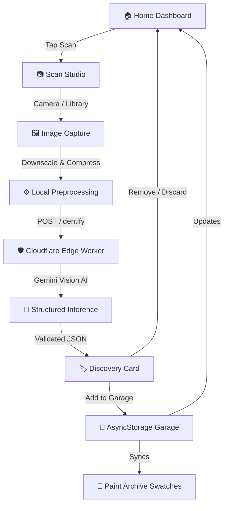
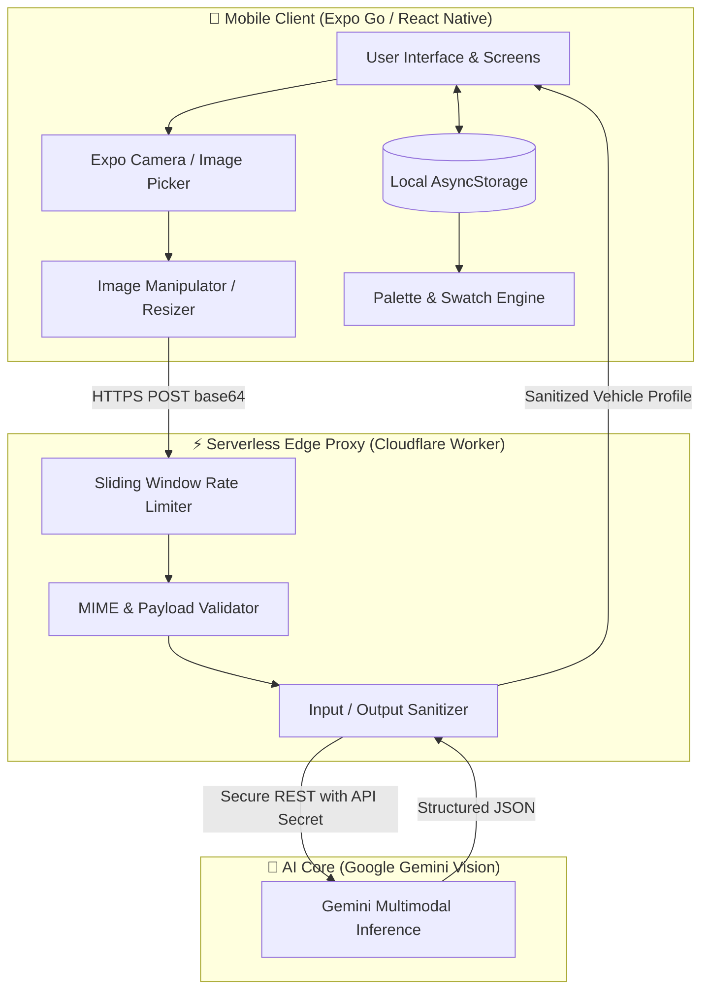
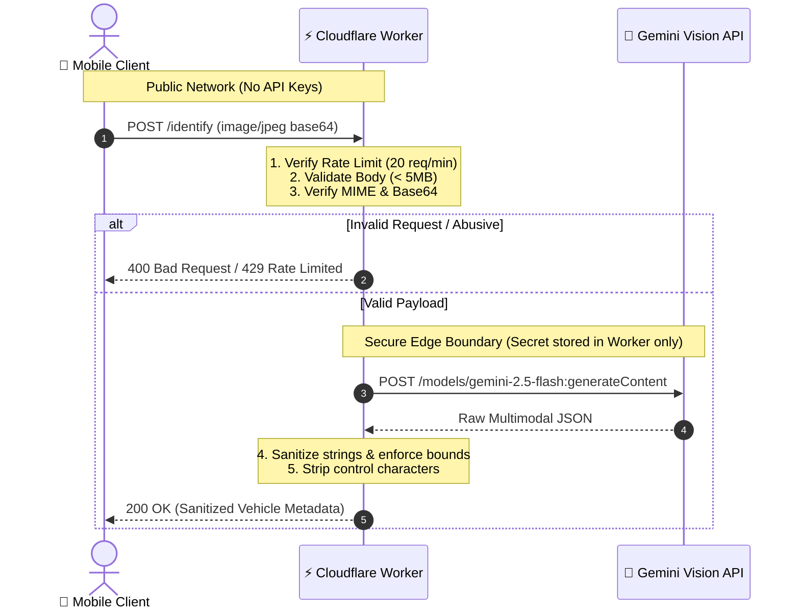

# 🏎️ CarDex

<div align="center">


### **Scan. Identify. Collect.**
*“Catch cars, not Pokémon.”*

[](https://expo.dev)
[](https://reactnative.dev)
[](https://www.typescriptlang.org)
[](https://workers.cloudflare.com)
[](https://ai.google.dev)

</div>

---

## 📡 Wild Encounter

**CarDex** is a mobile automotive field guide inspired by the tactile delight of classic handheld electronic encyclopedias. 

Spot an unfamiliar sports coupe, classic cruiser, or daily hatchback on the street? Open CarDex, take a picture, and within seconds the scanner identifies the **Make**, **Model**, **Variant**, **Body Class**, **AI Color**, and extracts the **Dominant Paint Swatch** from the car's body. Add your discovery to your offline **Garage**, level up your collection, and explore your personal **Paint Archive**.

Built from the ground up for a final-year Bachelor of Computer Applications (BCA) capstone project in **AI Tools and Techniques**, CarDex demonstrates modern edge AI vision, offline-first mobile architecture, and zero-trust proxy design—engineered completely within generous free-tier cloud limits.

---

## 🧭 Mission

Most AI apps today are thin wrappers that expose sensitive API keys in the client or require hefty monthly database subscriptions. 

CarDex was created to prove that a high-craft, AI-native mobile app can be:
1. **Explainable & Defendable**: Every layer—from camera capture to local image downsampling, edge proxy sanitization, multimodal prompt engineering, and offline persistence—is cleanly separated and explainable in a technical viva.
2. **Strictly Free-Tier & Zero-Cost**: Leverages Expo Go, Cloudflare Workers free compute, Google Gemini AI Studio, and device-local `AsyncStorage`.
3. **Zero Secrets in Client**: The mobile client has zero knowledge of API keys or AI credentials. All upstream communication passes through a secure edge proxy.

---

## 🎒 Starter Pack

| Layer | Technology | Purpose |
| :--- | :--- | :--- |
| **Mobile Core** | React Native `0.76` + Expo SDK `52` | Cross-platform native mobile engine |
| **Navigation** | Expo Router `v4` | Typed file-based routing |
| **Language** | TypeScript (Strict) | Compile-time correctness across client & worker |
| **Edge Proxy** | Cloudflare Workers | Request validation, abuse protection, secret isolation |
| **Vision Model** | Google Gemini Multimodal Vision | Zero-shot automotive identification & metadata |
| **Image Preprocessing**| `expo-image-manipulator` | Local downscaling, compression & aspect normalization |
| **Local Persistence** | `@react-native-async-storage` | Fully offline collection storage with defensive validation |
| **Animations** | `react-native-reanimated` | 60 FPS hardware-accelerated UI transitions |

---

## 🔍 The Scan

When a vehicle is spotted:
1. **Capture**: Snap a photo or select an existing image using `expo-image-picker`.
2. **Local Optimization**: The client immediately normalizes the image using `expo-image-manipulator`—downscaling to a maximum dimension of 1024px with 80% JPEG compression. This reduces network payload size by over 85% while preserving critical visual details (badges, grille patterns, light signatures).
3. **Secure Dispatch**: The mobile client dispatches a lightweight JSON payload containing base64 image data to the Cloudflare Worker proxy (`POST /identify`).
4. **Edge Validation**: The Worker validates MIME types, payload size (< 5MB), and enforces sliding-window IP rate limiting (20 requests/minute).
5. **AI Vision Identification**: The Worker calls Google Gemini Vision using a structured schema prompt, extracting vehicle identification, production era, and coordinates.
6. **Collectible Card Display**: The client renders an interactive collectible card complete with rarity tier, technical specs, and a direct action to save the car to your permanent offline collection.

---

## 📖 Field Guide Flow



---

## ⚙️ Professor's Notes (Architecture)

CarDex enforces a strict separation between client presentation, edge proxying, and upstream intelligence:



---

## 🛡️ Gym Badge (Security Architecture)

Security in CarDex is designed to be **real, robust, and defensible** without introducing unnecessary enterprise complexity:



### Security Posture & Verified Controls

* **Zero Secrets in Mobile Client**: The Gemini API key is never bundled in Expo code, never stored in `app.json`, never exported in `EXPO_PUBLIC_*` variables, and never committed to Git. The client only knows the public Worker URL.
* **Edge Abuse Protection**: The Worker proxy features an in-memory sliding-window IP rate limiter limiting clients to **20 identification requests per 60 seconds**, protecting against accidental loops or automated abuse.
* **Payload Constraints**: Requests exceeding 5MB or non-image MIME types (`image/jpeg`, `image/png`, `image/webp`) are immediately rejected at the edge before invoking the AI model.
* **Safe Error Handling**: Upstream AI errors or JSON schema mismatches return generalized, safe error codes (`UPSTREAM_ERROR`, `PARSE_ERROR`). Stack traces and internal paths are never returned to clients.
* **Security Headers**: Edge responses include defensive security headers:
  * `X-Content-Type-Options: nosniff`
  * `Referrer-Policy: no-referrer`
* **Defensive Local Persistence**: Local `AsyncStorage` operations validate stored record shapes upon read. Corrupted records or unparseable JSON entities are gracefully filtered out without crashing the application.
* **Authentication Status**: **Not Applicable**. CarDex is an offline-first personal collection tool. No user accounts, remote passwords, or server-side databases are used.

---

## 🏠 The Garage & 🎨 Paint Archive

### The Garage
Your offline vehicle showroom:
* Saved vehicles are stored locally on your device via `AsyncStorage`.
* Each entry receives a permanent, collision-resistant UUID (never indexed by unstable array keys).
* **Safe Deletion**: Open any vehicle detail view and tap **REMOVE FROM GARAGE**. A lightweight confirmation modal protects against accidental deletions. Confirming instantly updates the Garage collection, Home counts, and Palette swatches.

### Paint Archive
Every car scan records the dominant vehicle body color:
* The color archive organizes your finds by paint hue family (e.g., *Apex Red*, *Midnight Black*, *Liquid Silver*, *Sunburst Yellow*).
* Visual color chips allow browsing your collection through an automotive design lens.

---

## 🧰 Move Set (Commands & Setup)

### Prerequisites
* [Node.js](https://nodejs.org) (v18 or higher recommended)
* [npm](https://www.npmjs.com)
* [Expo Go](https://expo.dev/go) app installed on your physical iOS or Android device
* A free [Google AI Studio API Key](https://aistudio.google.com)

---

### Step 1: Clone the Repository
```bash
git clone https://github.com/Suhaid11/CarDex.git
cd CarDex
npm install
```

---

### Step 2: Configure Environment Variables

1. Copy the example environment file for the Expo client:
   ```bash
   cp .env.example .env.local
   ```
2. For testing on a physical phone on the same Wi-Fi network, point `EXPO_PUBLIC_API_URL` to your computer's local LAN IP:
   ```bash
   EXPO_PUBLIC_API_URL=http://192.168.1.XX:8787
   ```

> [!NOTE]
> `EXPO_PUBLIC_API_URL` is a public configuration endpoint. **Never** put your `GEMINI_API_KEY` in this file.

---

### Step 3: Run the Local Cloudflare Worker

The Cloudflare Worker proxy runs locally using Wrangler:

```bash
cd proxy
npm install
```

Start the Worker and pass your Gemini API key via your terminal environment:

**On Windows (PowerShell):**
```powershell
$env:GEMINI_API_KEY="your-gemini-api-key-here"
npx wrangler dev --ip 0.0.0.0 --port 8787
```

**On macOS / Linux:**
```bash
export GEMINI_API_KEY="your-gemini-api-key-here"
npx wrangler dev --ip 0.0.0.0 --port 8787
```

The Worker will bind to port `8787` on all local network interfaces (`0.0.0.0`), allowing your physical phone on the same Wi-Fi to reach it.

---

### Step 4: Start the Expo App

In the project root directory:

```bash
npx expo start -c
```

1. Open **Expo Go** on your physical iPhone or Android device.
2. Scan the terminal QR code.
3. The CarDex field guide is ready to scan cars!

---

### Step 5: Verification & Quality Gates

Run project verification commands at any time:

```bash
# Type check all TypeScript source files
npx tsc --noEmit

# Run project health & dependency audit
npx expo-doctor
```

---

## 🗂️ Project Structure

```text
CarDex/
├── app/                       # Expo Router typed screens
│   ├── _layout.tsx            # Root navigation stack & theme setup
│   ├── (tabs)/                # Main bottom navigation tab routes
│   │   ├── _layout.tsx        # Tab bar styling & haptics
│   │   ├── index.tsx          # Home: Dashboard, stats & quick access
│   │   ├── scan.tsx           # Scan: Camera viewfinder & scan flow
│   │   ├── garage.tsx         # Garage: Offline collection showroom
│   │   └── palette.tsx        # Palette: Vehicle paint color archive
│   ├── car/
│   │   └── [id].tsx           # Vehicle Detail view & delete action
│   └── about.tsx              # About & project specifications
├── assets/                    # Project branding & icons
│   ├── branding/              # Original CarDex SVG marks & concepts
│   └── images/                # App icon, splash screen & assets
├── proxy/                     # Cloudflare Worker edge proxy
│   ├── worker.ts              # Edge logic, rate limiter & Gemini handler
│   ├── wrangler.toml          # Worker serverless configuration
│   └── package.json           # Worker dependencies (Wrangler)
├── src/                       # Application business logic
│   ├── components/            # Reusable UI components
│   │   ├── CarCard.tsx        # Collectible card presentation
│   │   ├── Header.tsx         # Handheld scanner top header
│   │   └── DeleteConfirmModal.tsx # Safe deletion modal
│   ├── context/               # Global state management
│   │   └── GarageContext.tsx  # Garage reactive state & CRUD methods
│   ├── services/              # External interfaces & pipelines
│   │   ├── carApi.ts          # Network client for Worker proxy
│   │   ├── garageStorage.ts   # AsyncStorage serialization & verification
│   │   └── imageProcessor.ts  # Downsampling & base64 conversion
│   └── types/                 # Shared TypeScript interfaces
│       └── car.ts             # Vehicle, CarProfile & Palette models
├── .env.example               # Safe environment variable template
├── app.json                   # Expo application configuration & icons
├── package.json               # Client dependencies & scripts
└── tsconfig.json              # TypeScript compiler configuration
```

---

## 💡 Free-Tier Design Constraints

CarDex is designed from first principles to operate indefinitely with **zero cloud operational cost**:

* **Cloudflare Workers Free Tier**: Offers 100,000 requests per day at zero cost—more than sufficient for active development and demo usage.
* **Google Gemini API Free Tier**: Provides generous RPM (requests per minute) and RPD (requests per day) limits on flash models.
* **Single-Request Architecture**: One deliberate car scan translates to exactly **one** upstream model call. There are no runaway background polling loops or speculative pre-fetches.
* **Client-Side Compression**: Images are downsized to ≤ 1024px before transmission, drastically reducing bandwidth and edge memory consumption.
* **Local Storage**: Zero database hosting costs or egress fees.

---

## ⚠️ Troubleshooting

| Symptom | Cause | Solution |
| :--- | :--- | :--- |
| **"Network request failed" on phone** | Phone cannot reach PC LAN IP | Ensure PC and phone are on the exact same Wi-Fi. Check Windows Defender / firewall settings to allow incoming traffic on port `8787`. |
| **"Identification service unavailable"** | Missing or invalid Gemini API key | Check the terminal where `wrangler dev` is running. Ensure `GEMINI_API_KEY` is exported and valid. |
| **Rate limit error (HTTP 429)** | Exceeded 20 scans in 60 seconds | Wait 60 seconds before initiating another vehicle scan. |
| **Camera permission denied** | iOS / Android camera permissions not granted | Go to device Settings → Expo Go → Camera and toggle permission to **Allow**. |
| **Stale JavaScript in Expo Go** | Metro bundler cache | Stop the server and restart with `npx expo start -c`. |

---

## ⚡ Evolution Path (Roadmap)

- [x] Multi-tab retro handheld scanner navigation
- [x] Multimodal vehicle identification (Make, Model, Variant, Body Type)
- [x] Offline Garage persistence with defensive JSON verification
- [x] Color extraction & automotive Paint Archive
- [x] Zero-secret edge proxy with rate limiting & sanitization
- [x] Safe deletion confirmation with instant cross-screen synchronization
- [ ] ⬜ Multi-angle vehicle scans (front + rear composite analysis)
- [ ] ⬜ Acoustic engine exhaust note classifier
- [ ] ⬜ Local peer-to-peer CarDex card trading via QR code
- [ ] ⬜ Custom car notes & personal photography odometer logs

---

## 🤝 Trainers Welcome

Contributions, bug reports, and suggestions are welcome!
1. Fork the Project.
2. Create your Feature Branch (`git checkout -b feature/AmazingFeature`).
3. Verify type safety (`npx tsc --noEmit`) and Expo health (`npx expo-doctor`).
4. Commit your Changes (`git commit -m 'feat: add some AmazingFeature'`).
5. Push to the Branch (`git push origin feature/AmazingFeature`).
6. Open a Pull Request.

---

## 📜 Pokédex Disclaimer & Legal Notice

**CarDex is an independent educational student project** inspired by the nostalgic, playful field-guide concept of classic monster-collecting games and electronic encyclopedias. 

CarDex is **not affiliated with, authorized, maintained, sponsored, or endorsed** by Nintendo, Game Freak, or The Pokémon Company. All automotive trademarks, model names, badges, and brand designations referenced are the property of their respective manufacturers and are used strictly under fair use for educational identification and research purposes.

---

## 📄 License

Distributed under the **MIT License**. See `LICENSE` for more information.

<div align="center">
<sub>Engineered with ❤️ for the BCA Capstone Project in AI Tools and Techniques.</sub>
</div>
